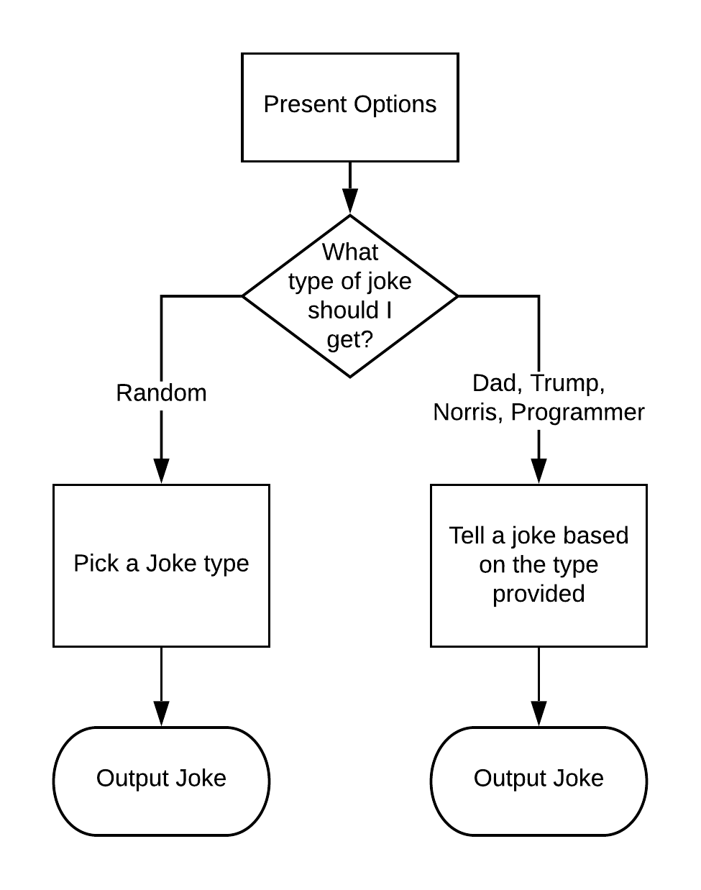

# Modules and Classes

By: Briant Gale

Example Repo: [Joke Generator](https://github.com/briantgale/joke_generator)

The overall goal of this training is to demonstrate skills for building organized, object-oriented applications using plain Ruby.

## 1. Introduction

Properly organizing code into modules and classes helps build maintainable code. There's a few high level concepts to understand:

1. When is a module used?
1. When is a class used?
1. When is it important to use class methods? Instance methods?
1. How should we efficiently organize our code?
1. Are there scenarios where it doesn't matter much?

A few things to keep in mind:

* A good portion of Rails is just basic Ruby
* Rails has given us a good model (no pun intended) to follow to keep our code organized, we need to respect that to keep our code clean.
  * A firm understanding of MVC helps up keep our code clean.
  * If it feels like code doesn't fit somewhere, it might be worth finding a better place for it.
  * The rails magic that we use is really just a lesson in efficient code design. E.G. concerns are just modules with a little extra help mixed in.
* Taking extra time out to understand the structure of something means that coming back later will be much simpler.

### Sample Project Requirements

To get started, I wanted to find something fun to build out to demonstrate some clean code. Instead of building a rails app, let's build a gem and take it through a few steps. Here is some acceptance criteria for my joke generator gem:

* A gem that can be used to tell jokes
* Should be able to specify the type of jokes
* Should be able to return multiple jokes at once
* A command line tool that tells a joke

### First attempt at a script

[Joke Generator, Branch 1](https://github.com/briantgale/joke_generator/tree/1)

Run the script:

```bash
ruby tell_a_joke.rb 
```

**What are the problems with this code?**
* Code is duplicated
* I'm not able to get multiple jokes back in a single call
* There's no obvious structure
* Adding a new joke service would be tricky, as there are multiple places to add it. In a larger code based, that wouldn't be as apparent.
* There is no easy interface to access a joke from another application.

**What are the obvious improvements that can be made?**
* Organize code into some methods to make it more expandable
* Build an interface that makes it easier to work with

## 2. Modules

Modules have 2 main purposes:
1. Namespacing code
  * This gives us a way to organize our code
  * Prevents namespace collisions
1. Mixin functionality
  * We can consolidate methods that might be usefull across multiple classes into a single place, then include that functionality later

**Modules are not instantiated, and therefore cannot have multiple instances.**

### Building some structure
The next logical step to improving our joke generator is to add structure to our code. Instead of using a rails app, let's build a gem to contain our code. Similar to the `rails new` command line tool, there's a command to build out an empty gem:

```bash
bundle gem joke_generator
```

This gives us the following file structure:
```
joke_generator
├── Gemfile
├── Gemfile.lock
├── README.md
├── Rakefile
├── bin
│   ├── console
│   └── setup
├── joke_generator.gemspec
└── lib
    ├── joke_generator
    │   └── version.rb
    └── joke_generator.rb
```

[Joke Generator, Branch 2](https://github.com/briantgale/joke_generator/tree/2)

I moved my original "script" version of the joke generator into the `JokeGenerator` module to get things moved. Additionally, I split things up into small methods.

**What improvements were made?**
* Code is organized into methods
* Wrapping up the code in a module makes it easier to use in other code

**What are the problems with this code?**
* We still haven't solved for duplicated code
* It's still hard to add additional services to this code
* There is still no logical organization
* Asking for multiple jokes would require wrapping up our code in a loop

## 3. Classes

* Allows us to build objects, AKA abstract data types that we get to define
* Allows us to add consistency to the way our application behaves by consolidating code
* Allows us to further organize our code into logical groups
* Allows for inheritance and structuring of like objects

Our joke generator has the following structure. It's simple, but is missing a few features that allow us to accomplish our task.



In order to make our process more object oriented, I like to follow a few steps of analysis:

1. Identifying high level classes
2. Abstract out common functionality
3. Rebuilding our interface

### Identifying high level classes

The first obvious adjustment we can make to our code is to identify the basic class structure we want to use. Since retrieving the jokes from different services might differ slightly, we can use that as our class structure. The new layout would look something like this:


Starting from branch 2, make the following changes to the code:

Create `lib/joke_generator/dad_joke.rb`

```ruby
class JokeGenerator::DadJoke

  def joke
    response = RestClient.get("https://icanhazdadjoke.com/", {accept: :json})
    JSON.parse(response.body)["joke"]
  end

end
```

Add these to `lib/joke_generator.rb`

```ruby
require "joke_generator/dad_joke"
```

Line 20 changes to:
```ruby
puts JokeGenerator::DadJoke.new.joke
```

[Joke Generator, Branch 3](https://github.com/briantgale/joke_generator/tree/3)

We've previously discussed the problems of the first 2 iterations of code. In order to make improvements, we need to break down the problem, and devise a structure for our app to make more sense. There's a few other improvements we could make to the structure of our code:

* Abstract out the common functionality, like the api call
* Make the URL, and path to the joke in the response part of the parent class
* Override that logic for the programmer joke class

### Abstract out common functionality

Inheritance gives us the ability to move common methods into a single place, then we can use those methods in our child classes, or override them if we want to implement custom functionality.


**Move common functionality**

What functionality can we move to the superclass?

* The obvious choice is the joke method. Since this is data that's going to be accessed over and over, let's make that an instance method so we can call it and get the same joke back.
* The API call is the same for each of our joke services, with the exeption of the URL. The logic can move to the superclass, while we make the endpoint a configuration.
* Accessing the joke from the api response is very similar for all the service except for the programmer joke. We'll write a method to extract that, then use a custom method on the programmer joke.

The first step is to create our superclass with some basic code. Create `lib/joke_generator/joke_service.rb`:

```ruby
class JokeGenerator::JokeService
  attr_reader :joke

  def initialize
    @joke = get_joke
  end

  private

  def get_joke
    response = RestClient.get(self.class::API_PATH, {accept: :json})
    extract_joke(JSON.parse(response.body))
  end

  def extract_joke(json)
    json.dig(*self.class::JSON_LOCATION)
  end
end
```

This moves the api call to the initialize method, and stores the resulting joke as an instance variable.


Make sure that our new superclass is required and avaiable for the child classes. Add this to `lib/joke_generator.rb`:

```ruby
require "joke_generator/joke_service"
```

We now need to change `joke_generator/dad_joke.rb` to inherit from `JokeGenerator::JokeService`. Since we're consolidating the code to the superclass, we can remove the existing code. `DadJoke` is now a child class of `JokeService`. It *inherits* the functionality of the methods, initializers, and instance methods that are defined in the super class. This can all be overridden. In cases where functionality needs to be added to, you can use **super** to refer to the superclass's implementation of a method. I'm not going to cover that here. The only missing piece we have is to make the class constants avaiable for the superclass to use. Add the following lines to `lib/joke_generator/dad_joke.rb`:

```ruby
API_PATH = "https://icanhazdadjoke.com/"
JSON_LOCATION = ["joke"]
```

Now, when you call `JokeGenerator::DadJoke.new.joke`, all the logic exists on the parent class. The only specifics on the child class our the constants. We can now modify `NorrisJoke` and `TrumpJoke` to work the same way. Make sure to also add the class inheritance.

**Override unique functionality**

The only thing left to deal with is the unique nature of parsing out the response on the programmer joke interface. Most of the process is the same, but parsing out the logic is the different part. Since we already set up a method in our base class to extract the joke, we can simply **override** that method.

Change `lib/joke_generator/programmer_joke.rb` to look like this:

```ruby
class JokeGenerator::ProgrammerJoke < JokeGenerator::JokeService
  API_PATH = "https://sv443.net/jokeapi/category/Programming"

  private

  def extract_joke(json)
    # This API returns 2 types of response, a general joke and a setup/punchline joke
    case json["type"]
    when "single"
      json["joke"]
    when "twopart"
      json.slice("setup", "delivery").values.join(" ")
    end
  end

end
```

The code should now be in this state: [Joke Generator, Branch 4](https://github.com/briantgale/joke_generator/tree/4)

### Rebuilding our interface

Once you've made sense of the data, and organized it, it's time to adjust our interface to the data, based on our requirements. While not completely necessary, it's nice to define an interface that we can use. This makes it nice so that if/when changes need to be made, the consumers don't need to know what changed behind the scenes.


Currently, we can tell a joke and specify the type of joke. We just need to be able to return multiple jokes. Since our classes are now organized, we can easily make some methods on our module to access the data we want.

Add the following to `lib/joke_generator/joke_service.rb`:

```ruby
JOKE_TYPES = %i(dad trump norris programmer)
```

There are other options to list child classes, but this should give us a list of joke types that we can use elsewhere for now.

For what we've been asked to do, we can now implement module methods that can access the code we've written. Remember, these methods don't need to exist on our joke classes, and we won't instantiate them. These will return joke objects that we can then use. Let's add these 2 methods to `lib/joke_generator.rb` (and replace the existing joke method):

```ruby
def self.joke(type:)
  type = type.to_sym if type.is_a?(String)

  raise "#{type} is not a valid joke type" unless JokeGenerator::JokeService::JOKE_TYPES.include?(type)

  klass = [type,"joke"].map(&:capitalize).join
  Object.const_get("JokeGenerator::#{klass}").new
end

def self.jokes(type:, count:)
  raise "#{type} is not a valid joke type" unless JokeGenerator::JokeService::JOKE_TYPES.include?(type)
  raise "count must be greater than 0" unless count > 0

  Array.new(count).map { joke(type: type) }
end
```

We now have a method to return a single joke with some simple error checking, and an implementation that calls that a number of times. The final step is to implement this on our command line tool. Let's add this method:

```ruby
def self.tell_a_joke
  puts "Pick your joke type:"

  JokeGenerator::JokeService::JOKE_TYPES.each_with_index do |joke_type, i|
    puts "#{i + 1}. #{joke_type.capitalize} Joke"
  end

  print "Your choice: "
  response = gets.chomp

  print "How many jokes should I tell (1-10)? "
  count = gets.chomp

  count = count.to_i 
  count = 1 if count < 1 || count > 10

  joke_type = JokeGenerator::JokeService::JOKE_TYPES[response.to_i - 1]

  puts "\n"
  jokes(type: joke_type, count: count).each do |joke|
    puts joke.joke
    puts "\n"
  end
end
```

This implements a data-driven implementation of our original version, where the types of jokes drive the behavior. There is no hard-coded pieces here, meaning we could add a joke type, and this utility would continue to work. It also implements the other methods on this module.

## Conclusion

