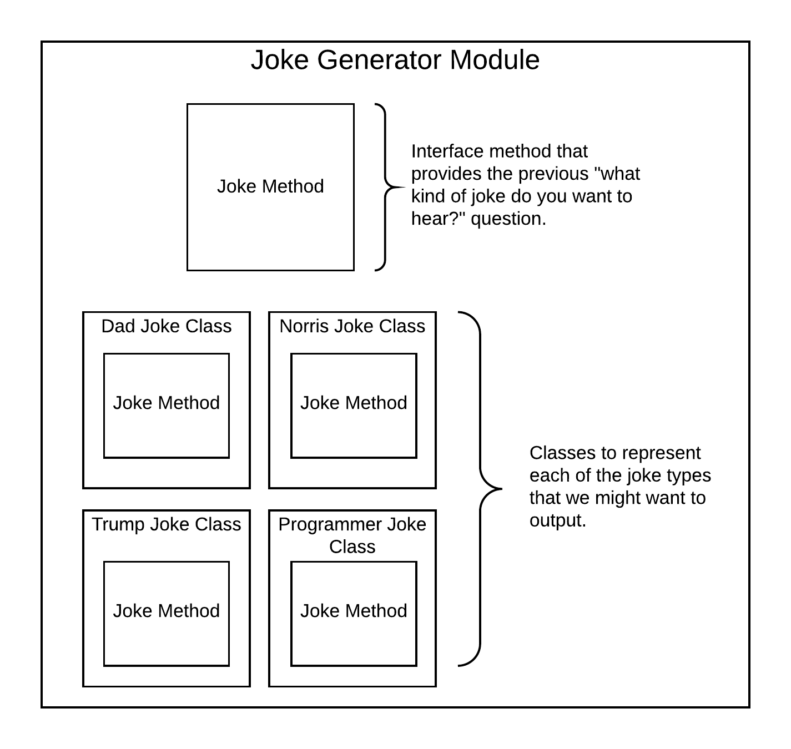

# Modules, Classes and Inheritance

By: Briant Gale

Example Repo: [Joke Generator](https://github.com/briantgale/joke_generator)

## 1. Introduction

Properly organizing code into modules and classes helps build maintainable code. There's a few high level concepts to understand:

1. When is a module used?
1. When is a class used?
1. When is it important to use class methods? Instance methods?
1. How should we efficiently organize our code?
1. Are there scenarios where it doesn't matter much?

A few things to keep in mind:

* A good portion of Rails is just basic Ruby
* Rails has given us a good model (no pun intended) to follow to keep our code organized, we need to respect that to keep our code clean.
  * A firm understanding of MVC helps up keep our code clean.
  * If it feels like code doesn't fit somewhere, it might be worth finding a better place for it.
  * The rails magic that we use is really just a lesson in efficient code design. E.G. concerns are just modules with a little extra help mixed in.
* Taking extra time out to understand the structure of something means that coming back later will be much simpler.

### Sample Project Requirements

To get started, I wanted to find something fun to build out to demonstrate some clean code. Instead of building a rails app, let's build a gem and take it through a few steps. Here is some acceptance criteria for my joke generator gem:

* A gem that can be used to tell jokes
* Should be able to specify the type of jokes
* Should be able to return the source of the joke
* Should be able to return multiple jokes at once

### Sample Code - First attempt
[Joke Generator, Branch 1](https://github.com/briantgale/joke_generator/tree/1)

Run the script:

```bash
ruby tell_a_joke.rb 
```

**What are the problems with this code?**
* Code is duplicated
* I'm not able to get multiple jokes back in a single call
* There's no obvious structure
* Adding a new joke service would be tricky, as there are multiple places to add it. In a larger code based, that wouldn't be as apparent.
* There is no easy interface to access a joke from another application.

**What are the obvious improvements that can be made?**
* Organize code into some methods to make it more expandable
* Build an interface that makes it easier to work with

## 2. Modules

Modules have 2 main purposes:
1. Namespacing code
  * This gives us a way to organize our code
  * Prevents namespace collisions
1. Mixin functionality
  * We can consolidate methods that might be usefull across multiple classes into a single place, then include that functionality later

**Modules are not instantiated, and therefore cannot have multiple instances.**

### Building some structure
The next logical step to improving our joke generator is to add structure to our code. Instead of using a rails app, let's build a gem to contain our code. Similar to the `rails new` command line tool, there's a command to build out an empty gem:

```bash
bundle gem joke_generator
```

This gives us the following file structure:
```
joke_generator
├── Gemfile
├── Gemfile.lock
├── README.md
├── Rakefile
├── bin
│   ├── console
│   └── setup
├── joke_generator.gemspec
└── lib
    ├── joke_generator
    │   └── version.rb
    └── joke_generator.rb
```

I moved my original "script" version of the joke generator into the `JokeGenerator` module to get things moved. Additionally, I split things up into small methods.

**What improvements were made?**
* Code is organized into methods
* Wrapping up the code in a module makes it easier to use in other code

**What are the problems with this code?**
* We still haven't solved for duplicated code
* It's still hard to add additional services to this code
* There is still no logical organization
* Asking for multiple jokes would require wrapping up our code in a loop

## 3. Classes

* Allows us to build objects, AKA abstract data types that we get to define
* Allows us to add consistency to the way our application behaves by consolidating code
* Allows us to further organize our code into logical groups
* Allows for inheritance and structuring of like objects

Our joke generator has the following structure. It's simple, but is missing a few features that allow us to accomplish our task.


In order to make our process more object oriented, I like to follow a few steps of analysis:

1. Identifying high level classes
2. Abstract out common functionality
3. Rebuilding our interface

### Identifying high level classes

The first obvious adjustment we can make to our code is to identify the basic class structure we want to use. Since retrieving the jokes from different services might differ slightly, we can use that as our class structure. The new layout would look something like this:



Notice the following

[Joke Generator, Branch 3](https://github.com/briantgale/joke_generator/tree/3)

We've previously discussed the problems of the first 2 iterations of code. In order to make improvements, we need to break down the problem, and devise a structure for our app to make more sense


